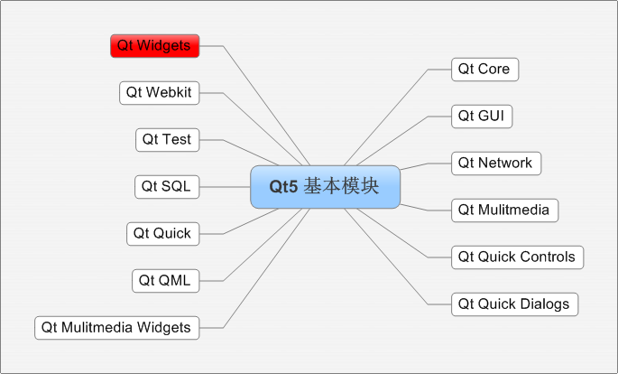

[toc]
## qt的基本认识
### qt的模块



### .pro文件解读
基本样式如下：
```
QT       += core gui  //包含的模块
greaterThan(QT_MAJOR_VERSION, 4): QT += widgets //大于Qt4版本 才包含widget模块
TARGET = QtFirst  //应用程序名  生成的.exe程序名称
TEMPLATE = app    //模板类型    应用程序模板
SOURCES += main.cpp\   //源文件
        mywidget.cpp
HEADERS  += mywidget.h   //头文件

```

#### pro详细解读
- 注释
从“#”开始，到这一行结束。
-	模板变量告诉qmake为这个应用程序生成哪种makefile。下面是可供使用的选择：TEMPLATE = app
-	app -建立一个应用程序的makefile。这是默认值，所以如果模板没有被指定，这个将被使用。
    - 	lib - 建立一个库的makefile。
    - vcapp - 建立一个应用程序的VisualStudio项目文件。
    - -vclib - 建立一个库的VisualStudio项目文件。
    - subdirs -这是一个特殊的模板，它可以创建一个能够进入特定目录并且为一个项目文件生成makefile并且为它调用make的makefile。
- 	#指定生成的应用程序名： 
> TARGET = QtDemo
- 	#工程中包含的头文件
HEADERS += include/painter.h
-	#工程中包含的.ui设计文件
>FORMS += forms/painter.ui
-	#工程中包含的源文件
>SOURCES += sources/main.cpp sources
- 	#工程中包含的资源文件
> RESOURCES += qrc/painter.qrc
>	greaterThan(QT_MAJOR_VERSION, 4): QT += widgets

这条语句的含义是，如果QT_MAJOR_VERSION大于4（也就是当前使用的Qt5及更高版本）需要增加widgets模块。如果项目仅需支持Qt5，也可以直接添加“QT += widgets”一句。不过为了保持代码兼容，最好还是按照QtCreator生成的语句编写。
-	#配置信息
CONFIG用来告诉qmake关于应用程序的配置信息。
> CONFIG += c++11	//使用c++11的特性

在这里使用“+=”，是因为我们添加我们的配置选项到任何一个已经存在中。这样做比使用“=”那样替换已经指定的所有选项更安全。

### 第一个程序解读
#### 创建第一个Qt程序
-	点击创建项目后，选择项目路径以及 给项目起名称
-	名称 -  不能有中文 不能有空格
-	路径 -  不能有中文路径
-	默认创建有窗口类，myWidget，基类有三种选择： QWidget 、QMainWindow、QDialog
#### main函数
- 	QApplication a  应用程序对象，有且仅有一个
- 	myWidget w;实例化窗口对象
-	w.show()调用show函数 显示窗口
- 	return a.exec() 让应用程序对象进入消息循环机制中，代码阻塞到当前行
#### 按钮控件常用API
- 创建 QPushButton * btn = new QPushButton
- 设置父亲  setParent(this)
- 	设置文本  setText(“文字”)
- 设置位置  move(宽，高)
- 	重新指定窗口大小  resize
- 	设置窗口标题 setWindowTitle
- 设置窗口固定大小 setFixedSize
#### 对象树
-	当创建的对象在堆区时候，如果指定的父亲是QObject派生下来的类或者QObject子类派生下来的类，可以不用管理释放的操作，将对象会放入到对象树中。
- 一定程度上简化了内存回收机制
#### Qt中的坐标系
- 左上角为 0 ， 0 点
-	x以右为正方向
-	y以下为正方向
#### 信号和槽
- 连接函数 ：connect
-	参数  
    -	参数1  信号的发送者
    -	参数2  发送的信号（函数地址）
    -	参数3  信号的接受者
    -	参数4  处理的槽函数 （函数的地址）
-	松散耦合
- 实现 点击按钮 关闭窗口的案例
>connect(btn ,  &QPushButton::click , this , &QWidget::close);

### 自定义信号和槽
图解如下：


- 自定义信号
    -	写到 signals下
    -	返回 void
    -	需要声明，不需要实现
    -	可以有参数	，可以重载
-  自定义槽函数
    -	返回void
    -	需要声明 ，也需要实现
    -	可以有参数 ，可以重载
    -	写到 public slot下 或者public 或者全局函数
-	触发自定义的信号
    -	emit 自定义信号
-	案例-下课后，老师触发饿了信号，学生响应信号，请客吃饭
-	当自定义信号和槽出现重载
   - 需要利用函数指针 明确指向函数的地址
>void( Teacher:: * tSignal )( QString ) = &Teacher::hungry;

- QString 转成  char *     
-	.ToUtf8() 转为 QByteArray
-	.Data() 转为 Char *
- 信号可以连接信号 
- 断开信号  disconnect
  
### 拓展

- 信号可以连接信号
- 一个信号可以连接多个槽函数
- 	多个信号可以连接同一个槽函数
- 	信号和槽函数的参数 必须类型一一对应
- 信号和槽的参数个数  是不是要一致？信号的参数个数 可以多余槽函数的参数个数
- 	信号槽可以断开连接  disconnect
### Qt4版本写法
-	connect( 信号的发送者， 发送的信号SIGNAL( 信号) ，信号接受者， 槽函数SLOT(槽函数)  )
-	优点 参数直观
-	缺点 编译器不会检测参数类型
### Lambda表达式
-	[]标识符  匿名函数 
-	 = 值传递
-	& 引用传递
-	() 参数 
-	{} 实现体
-	mutable 修饰 值传递变量 ，可以修改拷贝出的数据，改变不了本体
-	返回值 []() ->int {}


### 总结

