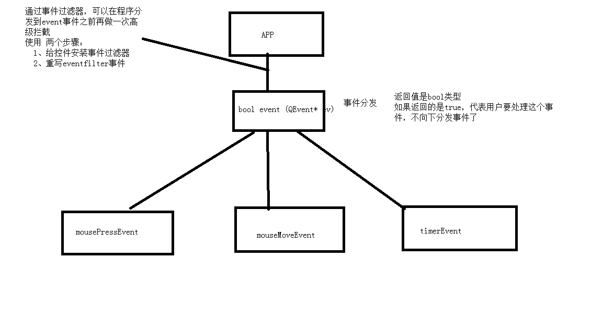

## qt事件处理器
总体流程如下：

### 自定义控件封装
-	添加新文件 -  Qt – 设计师界面类  (.h  .cpp  .ui)
- 	.ui中 设计 QSpinBox和QSlider 两个控件
- Widget中使用自定义控件，拖拽一个Widget，点击提升为，点击添加，点击提升
-	实现功能，改变数字，滑动条跟着移动 ，信号槽监听。
-	提供 getNum  和 setNum对外接口
-	测试接口

### Qt中的事件
- 鼠标事件
- 鼠标进入事件  enterEvent
- 	鼠标离开事件  leaveEvent
-	鼠标按下   mousePressEvent ( QMouseEvent  ev)
-	鼠标释放   mouseReleaseEvent
- 鼠标移动   mouseMoveEvent
- ev->x() x坐标  ev->y() y坐标
-	ev->button() 可以判断所有按键 Qt::LeftButton  Qt::RightButton
-	ev->buttons()判断组合按键  判断move时候的左右键  结合 & 操作符
-	格式化字符串  QString( “ %1  %2 ” ).arg( 111 ).arg(222)
-	设置鼠标追踪    setMouseTracking(true);

### 定时器1
-利用事件 void  timerEvent ( QTimerEvent * ev)
- 启动定时器 startTimer( 1000) 毫秒单位
-	timerEvent 的返回值是定时器的唯一标示  可以和ev->timerId 做比较
###	定时器2
-利用定时器类 QTimer
- 创建定时器对象 QTimer * timer = new QTimer(this)
- 	启动定时器  timer->start(毫秒)
- 	每隔一定毫秒，发送信号  timeout  ,进行监听
- 暂停  timer->stop

###	event事件
-	用途：用于事件的分发
-	也可以做拦截操作，不建议
-	bool event( QEvent * e); 
-	返回值 如果是true 代表用户处理这个事件，不向下分发了
-	e->type() == 鼠标按下 

### 事件过滤器  
- 在程序将时间分发到事件分发器前，可以利用过滤器做拦截
-	步骤
    -	1、给控件安装事件过滤器
    -	2、重写 eventFilter函数 （obj ， ev）

### QPainter 绘图
-	绘图事件  void paintEvent()
-	声明一个画家对象  QPainter  painter(this)  this指定绘图设备
- 画线、画圆、画矩形、画文字
- 设置画笔 QPen  设置画笔宽度 、风格
- 	设置画刷 QBrush 设置画刷 风格
###	QPainter高级设置
- 抗锯齿 效率低
  - painter.setRenderHint(QPainter::Antialiasing);
- 对画家进行移动
    -	painter.translate(100,0);
    -	保存状态 save
    -	还原状态 restore
- 如果想手动调用绘图事件 利用update
-	利用画家画图片 painter.drawPixmap( x，y，QPixmap(  路飞) )

###	QPaintDevice绘图设备
-	QPixmap QImage  QBitmap(黑白色) QPicture  QWidget
-	QPixmap 对不同平台做了显示的优化
    -	QPixmap pix( 300,300)
    -	pix.fill( 填充颜色 )
    -	利用画家 往pix上画画  QPainter painter( & pix)
    -	保存  pix.save( “路径”)
-	Qimage 可以对像素进行访问
    -	使用和QPixmap差不多 QImage img(300,300,QImage::Format_RGB32);
    -	其他流程和QPixmap一样
    -	可以对像素进行修改 img.setPixel(i,j,value);
- QPicture  记录和重现 绘图指令
    -  	QPicture pic
    -	painter.begin(&pic);
    -  	保存 pic.save( 任意后缀名 )
    -	重现 利用画家可以重现painter.drawPicture(0,0,pic);
### QFile 对文件进行读写操作
-   QFile进行读写操作
-	QFile file( path 文件路径)
-	读
-	file.open(打开方式) QIODevice::readOnly
    -	全部读取  file.readAll()   按行读  file.readLine()  atend()判断是否读到文件尾
    -	默认支持编码格式 utf-8
    -	利用编码格式类 指定格式 QTextCodeC 
    -	QTextCodec * codec = QTextCodec::codecForName("gbk");
    -	//ui->textEdit->setText( codec->toUnicode(array)  );
    -	文件对象关闭 close
-	写
    - file.open( QIODevice::writeOnly  / Append)
    -	file.write(内容)
    -	file.close 关闭
###	QFileInfo 读取文件信息
-	QFileInfo info(路径)

-	qDebug() << "大小：" << info.size() << " 后缀名：" << info.suffix() << " 文件名称："<<info.fileName() << " 文件路径："<< info.filePath();

- qDebug() << "创建日期：" << info.created().toString("yyyy/MM/dd hh:mm:ss");
-	qDebug() << "最后修改日期："<<info.lastModified().toString("yyyy-MM-dd hh:mm:ss");

