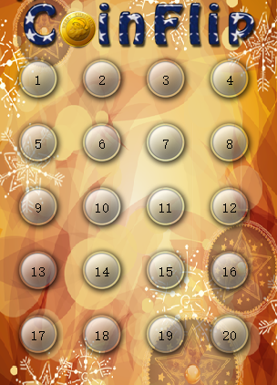
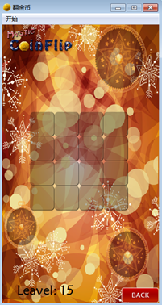

## for循环之妙用
### 关卡图标的绘制
如下图所示图标，是如何绘制出来的呢?



#### 代码理解
for循环的妙用,将图片按照一定的规律给递归分布,后将序列号写上。
```
for(int i = 0,i<20,i++){
    menuBtn ->move(25+(i%4)*70,130+(i/4)*70);
    label ->setText(QString::number(i+1));
}
```
完整详细代码见下
```
  //创建关卡按钮
    for(int i =0;i<20;i++){
        MyPushButton * menuBtn = new MyPushButton(":/res/LevelIcon.png");
        menuBtn ->setParent(this);
        menuBtn ->move(25+(i%4)*70,130+(i/4)*70);

        //按钮上显示的文字
        QLabel * label = new QLabel;
        label ->setParent(this);
        label ->setFixedSize(menuBtn->width(),menuBtn->height());
        label ->setText(QString::number(i+1));
        //设置居中
        label ->setAlignment(Qt::AlignHCenter | Qt::AlignVCenter);
        //移动
        label->move(25 + (i%4)*70 , 130+ (i/4)*70);
        //鼠标事件穿透
        label->setAttribute(Qt::WA_TransparentForMouseEvents,true);
        //监听选择关卡按钮的信号槽
        connect(menuBtn,&MyPushButton::clicked,[=](){
           if(pScene ==NULL){
               this ->hide();
               pScene = new PlayScene(i+1);
               pScene ->setGeometry(this->geometry());
               chooseSound->play();
               pScene ->show();

             //监听信号
            connect(pScene,&PlayScene::chooseSceneBack,[=](){
                this->setGeometry(pScene->geometry());
                  this->show();
                  backSound->play();
                  delete pScene;
                  pScene = NULL;
                              });
           }
        });
```
### 金币方格的绘制

如下图所示图标，是如何绘制出来的呢?



#### 代码理解

```
    //创建金币的背景图片
      for(int i = 0 ; i < 4;i++)
      {
          for(int j = 0 ; j < 4; j++)
          {
             //绘制背景图片
              QPixmap  pix = QPixmap(":/res/BoardNode.png");
              QLabel* label = new QLabel;
              label->setGeometry(0,0,pix.width(),pix.height());
              label->setPixmap(pix);
              label->setParent(this);
              label->move(57 + i*50,200+j*50);
          }
      }

```

### 总结

以为两个小例子分别用for 循环完成了多场景的创建，值得借鉴。