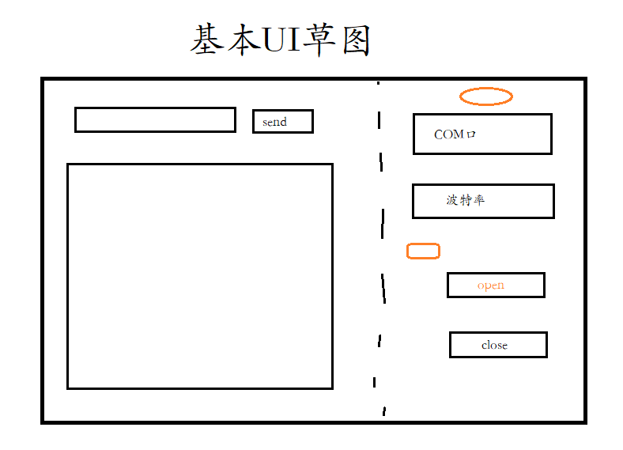
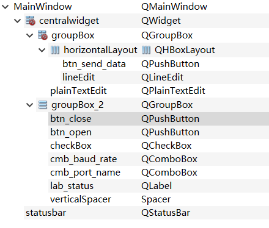
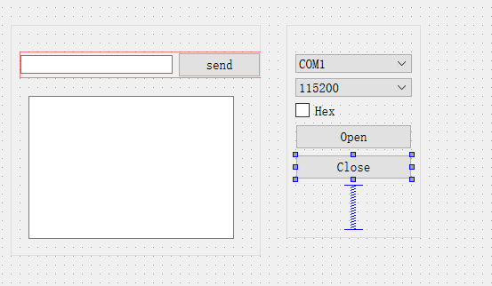

## 串口助手

使用qt制作的串口助手工具，参考教程[b站视频](https://www.bilibili.com/video/BV1EE4117728?from=search&seid=17361953889796866788)

## 基本配置
- ui设计
- 控件命名规范
- 完成波特率，串口，奇偶校验等操作
- 代码实现逻辑与规范

## ui 设计
ui基本草图如下:



主要控件是`pushbutton`,`combox`,`label`等等，具体结构与命名规则见下：



真实ui如下：



## 代码逻辑
### pro配置文件
在`pro文件`里面添加
```
QT  += core gui serialport(新加)
RC_ICONS = favicon.ico //图标设置
```
### 头文件h
- 添加相关库的头文件
- 自定义槽函数
  ```
  public slots:
    //button
    void btn_open_port(bool);
    void btn_send_data(bool);
    void btn_close_port(bool);

    //receive_data
    void receive_data();
  ```

- 自定义初始化函数以及全局定义QSerialPort
   ```
     /*----------funtion-----------*/
    void system_init();
    /*----------variable----------*/
    QSerialPort global_port ;
   ```

### 执行文件cpp
注意代码规范！！！在该部分完成了槽函数的实现与调用！
代码量不多，但是封装的很好，可以多看看！！！

### 小结
该程序的ui还需优化，串口助手的功能还需拓展，应与真实单片机完成交互！！！
